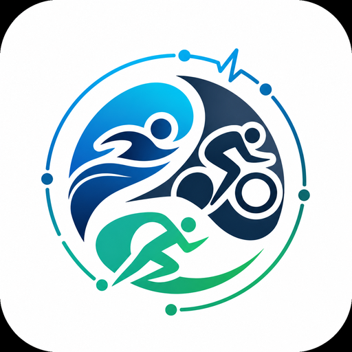
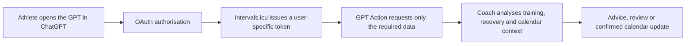

<div align="center">



# Open Triathlon Coach for ChatGPT

**An independent, open-source triathlon coach for ChatGPT that analyses your authorised Intervals.icu activities, wellness, thresholds, and calendar data. Not affiliated with or endorsed by Intervals.icu.**

[Project website](https://takethis88.github.io/intervals-icu-triathlon-gpt-coach/) ·
[Privacy policy](https://takethis88.github.io/intervals-icu-triathlon-gpt-coach/privacy.html) ·
[Report an issue](https://github.com/Takethis88/intervals-icu-triathlon-gpt-coach/issues)

</div>

> **Documentation and policy baseline:** `1.0.0` — reviewed 21 July 2026. See [POLICY_BASELINE.md](POLICY_BASELINE.md).

> **Project status:** pre-release. The core coaching workflow is being tested with a private development connection. Public per-user OAuth access is being prepared for the first working v1.0 release.

## What is this?

Open Triathlon Coach for ChatGPT is a custom ChatGPT coach designed to work with the athlete data already stored in [Intervals.icu](https://intervals.icu/).

A generic AI coach only knows what an athlete manually types into a conversation. This project is intended to let the coach inspect the athlete's authorised training history, wellness trends, current thresholds, calendar and planned sessions before answering.

That means the coach can respond to questions such as:

- What did I actually do over the last two weeks?
- Am I absorbing the current training block?
- Was yesterday's threshold session productive or excessive?
- How should today's session change after a hard ride, poor sleep or an unexpected race effort?
- Is my run, bike or swim threshold still consistent with recent performance?
- How should the next training week fit around my races and recovery?
- Can you create the agreed workouts in my Intervals.icu calendar?

The aim is not to generate isolated workouts. It is to create a continuous coaching workflow in which recommendations are grounded in the athlete's real training and can evolve as new sessions are completed.


## How to start using the coach

> **Pre-release note:** these are the intended end-user steps for v1.0. Until the public OAuth application and ChatGPT listing are live, the coach is not yet available for general use.

You do not need to install software, run code, create an API key, or give the coach your Intervals.icu password. The public version will run inside ChatGPT and connect to each athlete's own Intervals.icu account through OAuth.

### What you need

- A ChatGPT account that can open the published GPT and use its Action.
- An Intervals.icu account.
- Recent activities synced into Intervals.icu from Garmin, Zwift, Wahoo, COROS, Polar, Suunto, Strava, manual uploads, or another supported source.
- Correct sport settings in Intervals.icu, especially cycling FTP, run and swim threshold pace, LTHR, maximum heart rate, and training zones.
- For deeper recovery analysis, consistent wellness data such as sleep, HRV, resting heart rate, weight, fatigue, mood, and motivation.
- For useful planning, upcoming races, planned workouts, availability, and other important calendar constraints.

The coach can only reason over the data and context it receives. It does not automatically know about an injury, work trip, equipment problem, race goal, family commitment, or change in available training time unless that information is recorded in Intervals.icu or supplied in the conversation.

### Step 1 — Prepare Intervals.icu

Before opening the coach:

1. Sign in to Intervals.icu.
2. Open **Settings** and connect the services or devices that hold your training data.
3. Confirm that recent swim, bike, and run activities appear correctly.
4. Check for duplicate activities, missing sensor streams, incorrect pool lengths, implausible GPS data, or power-meter calibration problems.
5. Review the sport settings used for each discipline:
   - bike FTP and power zones;
   - run threshold pace and pace zones;
   - swim threshold pace and pace zones;
   - LTHR and heart-rate zones.
6. Add upcoming races and important calendar events where possible.
7. Enable or import wellness data if you want recovery and readiness analysis.

Direct, complete activity files are generally more useful than summary-only records. For example, meaningful cycling analysis is stronger when the file includes power, heart rate, cadence, and interval data from a power meter, smart trainer, head unit, or Zwift.

### Step 2 — Open the coach in ChatGPT

Open **Open Triathlon Coach for ChatGPT** from its ChatGPT listing. The public link will be added here when v1.0 is released.

For complex training analysis, select the **highest reasoning level that still supports the GPT's custom Action**. At this policy baseline, OpenAI states that custom Actions are unavailable in **Pro mode**. Use **Extra High** when it is offered with the Action; otherwise use **High**, **Medium**, or the highest Action-compatible option shown for your account.

Higher reasoning effort is recommended for:

- combining training, wellness, and calendar data;
- interpreting thresholds and zones;
- converting metric and imperial units;
- comparing several activities or training periods;
- planning a block or taper;
- checking a proposed account change.

It reduces some avoidable errors but does not guarantee a correct answer.

### Step 3 — Connect your Intervals.icu account

The first time the coach needs Intervals.icu data:

1. Select the **Connect**, **Sign in**, or equivalent Action button shown by ChatGPT.
2. ChatGPT will redirect you to Intervals.icu.
3. Sign in to the correct Intervals.icu account.
4. Review the requested permissions.
5. Approve the connection only if you are comfortable with those permissions.
6. Intervals.icu will redirect you back to ChatGPT.

The production OAuth Action requests this exact scope string:

`ACTIVITY:READ,WELLNESS:WRITE,CALENDAR:WRITE,LIBRARY:READ,SETTINGS:READ`

In Intervals.icu, `WRITE` access includes `READ` access for the same category. The scope therefore allows wellness and calendar reading as well as the controlled writes described below.

The production OAuth permissions allow the coach to:

- read activities and performance data;
- read profile, thresholds, zones, and sport settings;
- read wellness and recovery data;
- read planned workouts, races, and calendar events;
- read the workout library;
- create calendar items when explicitly requested;
- update selected wellness fields when explicitly requested.

The current Action does **not** include delete operations.

Do not paste an Intervals.icu API key, OAuth token, client secret, password, or Authorization header into the conversation. OAuth is designed so each user authorises their own account without revealing those credentials to the coach.

### Step 4 — Run a read-only validation

Start with a read-only check before asking the coach to change anything:

> Connect to my Intervals.icu account. Do not modify anything. Read my profile and sport settings, confirm my timezone and preferred units, and summarise my bike FTP, run threshold, swim threshold, LTHR, maximum heart rate, and zones. Show the raw threshold field and conversion if anything appears inconsistent.

Compare the result with the values shown in Intervals.icu.

Pay particular attention to:

- run pace in `min/km` or `min/mi`;
- swim pace in `min/100 m` or `min/100 yd`;
- FTP and power zones;
- LTHR and maximum heart rate;
- timezone and date boundaries;
- current weight and preferred units.

If a threshold looks wrong, ask:

> Show the raw Intervals.icu field, its source unit, the conversion formula, and the relevant 100% zone boundary. Do not modify anything.

### Step 5 — Give the coach the context that data cannot provide

After validating the connection, tell the coach about the parts of your situation that are not reliably captured by activity files:

- your main race and target date;
- current training phase;
- realistic weekly training time;
- days or sessions that are fixed;
- recent injuries, pain, illness, or return-to-training restrictions;
- equipment available for swim, bike, run, strength, and indoor training;
- preferred units;
- fuelling constraints;
- travel, work, sleep, family, or environmental constraints;
- whether you want recommendations only or calendar write-back.

A useful onboarding prompt is:

> My main race is [event and date]. I can train [hours] per week. My fixed commitments are [days/times]. My current limitations are [injury, equipment, travel, or recovery constraints]. Use [metric/imperial] units. Review my last 14 days, my next 14 days, and my current thresholds, then identify the three priorities for my next training block. Do not modify my calendar yet.

### Step 6 — Use the coach continuously

The coach is most useful as a continuing workflow rather than a one-off plan generator.

Typical use:

1. Review a completed key session.
2. Compare execution with the intended purpose.
3. Check wellness and accumulated load.
4. Consider upcoming workouts and races.
5. Adjust the next session or week.
6. Create agreed workouts only after reviewing the proposed plan.
7. Record relevant subjective context such as RPE, fatigue, pain, confidence, or unusual conditions.

Example check-in:

> Review my last seven days of completed training, the last 14 days of wellness, and the next seven days of planned sessions. Tell me what is going well, what is becoming a risk, and what I should change. Do not modify anything.

### Step 7 — Review every write operation

The Action can create calendar events and update selected wellness fields. Before approving a write, verify:

- the exact date and timezone;
- sport and event category;
- workout name and duration;
- workout steps and intensity targets;
- target training load;
- weight or wellness units;
- whether the item may already exist.

After a timeout or unclear response, check Intervals.icu before asking the coach to repeat the write. This reduces the risk of duplicate workouts or events.

### Disconnecting the coach

You can stop using the GPT at any time. To revoke its Intervals.icu access, use the connected-application controls in Intervals.icu. Deleting a ChatGPT conversation does not itself revoke the OAuth connection.

### Privacy during setup and use

- The builder has disabled the GPT-level setting labelled **“Use conversation data in your GPT to improve our models”** for this GPT.
- That builder setting is not presented as a blanket guarantee that OpenAI never processes, retains, or uses chat content. OpenAI's current public guidance says model-improvement use also depends on the user's plan and account-level **Data Controls**.
- Consumer users who want their new chats excluded from model improvement should also turn off **Improve the model for everyone** in ChatGPT Data Controls, or use Temporary Chat where available. Business, Enterprise, and Edu data is not used for training by default under OpenAI's current guidance. Deliberately submitted feedback may be handled separately.
- GPT builders cannot view users' individual conversations through the GPT builder.
- Relevant parts of a request and authorised account data may be exchanged with Intervals.icu when the Action reads or changes information.
- The project does not operate a separate database, OAuth proxy, or API server for athlete data.

Review the [privacy policy](https://takethis88.github.io/intervals-icu-triathlon-gpt-coach/privacy.html) before connecting the account.


## The coach depends on good source data

This coach does not measure the athlete directly. It reasons over the information available in Intervals.icu, so the quality of its analysis depends heavily on the quality, completeness, and consistency of the data recorded by the athlete's devices and services.

Useful source data may come from:

- Garmin, Polar, Suunto, COROS, Wahoo, or another training watch or bike computer;
- Zwift or another indoor-training platform;
- a cycling power meter or smart trainer;
- a heart-rate strap or optical heart-rate sensor;
- running-power, cadence, speed, temperature, or other supported sensors;
- pool-swim or open-water activity files;
- sleep, HRV, resting-heart-rate, weight, and wellness sources;
- manual athlete notes, perceived exertion, fatigue, mood, motivation, injury, and illness entries.

Intervals.icu supports integrations including Garmin, Polar, Suunto, COROS, Wahoo, Strava, and Zwift, but the coach can only analyse fields that actually reach the athlete's Intervals.icu account. A connected service does not guarantee that every sensor stream or metric is present in every activity.

### What this means in practice

- Cycling power analysis requires reliable power data from a power meter, smart trainer, or other recorded source.
- Heart-rate drift and aerobic-efficiency analysis require usable heart-rate data and, where relevant, power or pace recorded over the same session.
- Running and swimming pace analysis depends on accurate distance, time, GPS, lap, or pool-length information.
- Recovery analysis is stronger when sleep, HRV, resting heart rate, subjective wellness, and recent training are consistently available.
- Missing, duplicated, incorrectly calibrated, or poorly synced data can produce weak or misleading conclusions.
- Different recording sources may contain different fields for the same activity. The coach should identify uncertainty rather than assume one source is complete.

The athlete remains responsible for sensor setup, calibration, recording quality, duplicate management, and checking that activities and wellness data have synced correctly.

## Why the project exists

The original prototype was built around a real age-group triathlon journey: returning to structured training after several years away from sport, rebuilding around previous injury concerns, preparing for a sprint triathlon and a 4 km open-water swim, and working toward a longer-term full-distance triathlon goal.

It grew out of a practical problem. Training data was already available in Intervals.icu, Zwift and Garmin, but making useful decisions still required repeatedly copying numbers into a chat and explaining the surrounding context. The coach was developed to close that gap.

## How it has been used in real training

The coach has already been used as more than a workout generator.

### Building structured training blocks

It has helped create progressive swim, bike and run blocks, including:

- aerobic base and endurance work;
- bike cadence and torque sessions;
- tempo, sweet-spot, threshold and aerobic-ceiling work;
- long controlled rides;
- easy runs and short brick runs;
- swim technique, threshold and open-water preparation;
- deload weeks and race-specific adjustments.

Workouts have been written in formats suitable for Intervals.icu and, through the athlete's existing ecosystem, used with Zwift and Garmin.

### Reviewing completed sessions

The coach has analysed real activities rather than relying only on planned targets. Examples include:

- assessing whether a five-kilometre run was genuinely easy or had become a hard performance effort;
- using a completed `5 × 4 minute` cycling session to validate a higher working FTP;
- reviewing long endurance rides for power control, heart-rate response and fatigue;
- separating average power, normalised effort, heart rate, training load and subjective fatigue;
- changing the following day's training when the accumulated stress was higher than planned.

The useful output is not merely “good session” or “bad session.” The coach is expected to explain what happened, what can reasonably be inferred, what remains uncertain, and what should change next.

### Adapting the plan

The project has been used to make day-to-day and block-level decisions, such as:

- reducing a session after an unexpectedly hard run;
- keeping a swim easy after a large bike load;
- protecting the athlete's run durability while cycling fitness increased quickly;
- adding higher-intensity bike work only after the aerobic base was established;
- balancing race preparation with recovery and injury risk;
- adjusting race-week priorities around a sprint triathlon followed closely by a long open-water event.

### Preparing for races

The coach has supported preparation beyond fitness metrics, including:

- race-specific swim, bike and run targets;
- open-water confidence, sighting and pacing;
- taper and readiness discussions;
- bike-position and aero adaptation;
- race equipment and emergency-kit decisions;
- fuelling and hydration planning;
- interpreting race rules and event logistics.

### Correcting data interpretation

Real testing has also exposed the kind of errors this project is intended to prevent.

For example, Intervals.icu may expose a run threshold as a speed in metres per second. A raw value around `3.42` must be converted to approximately `4:52–4:53 min/km`, not interpreted as `3:25 min/km`. The project now contains explicit metric and imperial conversion rules and checks threshold pace against the athlete's configured zones.

## What the coach can access

Subject to the permissions granted by the athlete, the Action is designed to work with:

- athlete profile and sport settings;
- cycling FTP, threshold pace, LTHR and training zones;
- completed activities and detailed intervals;
- training load, CTL, ATL, form and ramp rate;
- HRV, resting heart rate, sleep and subjective wellness;
- planned workouts, races and other calendar events;
- cycling power curves;
- running and swimming pace curves;
- heart-rate curves;
- saved workout libraries and folders;
- routes and route metadata;
- account-linked weather forecasts.

Not every field is present for every athlete or activity. The coach must report missing data instead of inventing it.

## What it can do

### Athlete overview

The coach can assemble an initial picture of the athlete's configured thresholds, zones, recent training, recovery trends, schedule and goals.

### Session analysis

It can inspect a completed swim, bike or run, retrieve detailed intervals where available, and separate observed data from coaching interpretation.

### Recovery and readiness

It can combine recent activities with wellness trends rather than judging readiness from a single metric. CTL, ATL and form are treated as modelling inputs, not medical diagnoses.

### Training planning

It can recommend the next session, week or training block using:

- completed training;
- current fatigue and recovery;
- configured thresholds;
- upcoming races;
- the existing Intervals.icu calendar;
- the athlete's available time and stated constraints.

### Calendar write-back

With explicit confirmation, the Action can create planned workouts and events in Intervals.icu. The production Action also supports updating selected wellness fields.

Write operations are deliberately treated as consequential. The coach should confirm dates, sport, duration and material workout details before changing the athlete's account.

### Metric and imperial units

The coach is designed to work in either system:

- `min/km` or `min/mi`;
- `min/100 m` or `min/100 yd`;
- kilometres or miles;
- metres or feet;
- kilograms or pounds;
- Celsius or Fahrenheit;
- kilometres per hour or miles per hour.

Source values are preserved internally and converted only for presentation or when the API requires a specific unit.

## Capabilities not yet exercised as deeply

The core workflows so far have centred on training blocks, completed-session review, threshold validation, recovery decisions and race preparation. The API also enables several areas that have not yet been tested as extensively:

### Long-term performance curves

The coach can compare current and previous cycling power curves, running pace curves and swim pace curves across different time windows. This could help identify whether changes are occurring mainly in sprint power, threshold ability or endurance.

### Route-aware planning

Saved route distance, elevation and surface information could be used to match training sessions to specific routes or prepare for course demands.

### Weather-aware planning

Account-linked forecasts could help decide when to move an outdoor session, alter clothing or hydration recommendations, or substitute an indoor session. Forecasts should always be presented with appropriate uncertainty.

### Workout-library discovery

The coach can search existing workouts and training-plan folders before creating something new, reducing duplication and allowing athletes to reuse sessions that already work well for them.

### More systematic race modelling

Future testing can explore race-readiness assessments, taper comparisons, discipline-specific limiter analysis and realistic pacing scenarios using the athlete's recent curves and race calendar.

### Broader wellness logging

The Action can update fields such as weight, fatigue, mood, motivation, HRV, resting heart rate and sleep. The coach must not infer subjective ratings or medical states without a clear user instruction.

## Example conversations

- **Review my last 14 days and tell me how ready I am to train today.**
- **Analyse my most recent cycling session, including its intervals, and tell me whether my FTP still looks appropriate.**
- **Compare my configured run threshold with my recent pace data. Show both min/km and min/mile.**
- **Find my next priority race and assess whether my training is on track.**
- **Build my next training week around my recovery, current calendar and upcoming races.**
- **Compare my current-season and previous-season power curves.**
- **Find a suitable threshold workout in my library before creating a new one.**
- **Create the agreed workouts in my calendar after showing me the plan first.**

## How it works



The intended public version uses OAuth. Each athlete authorises their own Intervals.icu account, and athlete-scoped endpoints use `/athlete/0` so requests resolve to the athlete associated with that user's token.

The project does not require athletes to paste an Intervals.icu password or personal API key into a conversation.


## Recommended ChatGPT reasoning setting

For training analysis, recovery assessment, threshold interpretation, unit conversion, and calendar planning, use the **highest reasoning level that supports the custom Action**.

At the documentation baseline reviewed on 21 July 2026, OpenAI states that custom Actions are unavailable in **Pro mode**. Do not select Pro for this coach. Use **Extra High** when ChatGPT offers it while keeping the Action available; otherwise use **High**, **Medium**, or the highest Action-compatible option available to the user. Model names and availability can change, so Action compatibility takes priority over the label.

This recommendation matters because the coach often needs to:

- combine activities, wellness, thresholds, zones, and future calendar events;
- distinguish raw API fields from derived values;
- convert pace and units correctly;
- detect conflicting or incomplete data;
- avoid duplicate or unintended write operations;
- separate evidence from coaching inference.

Prompt engineering, schemas, validation rules, and a curated knowledge base reduce predictable mistakes, but they cannot eliminate errors intrinsic to generative AI. Greater reasoning effort can reduce some errors by allowing more extensive analysis, but it does not guarantee correctness.

Users should verify important figures—especially thresholds, dates, unit conversions, race plans, and account changes—before acting on them. Medical, injury, or safety-critical decisions require appropriate professional advice.

## Safety and design principles

- **Minimum necessary access:** request only the data needed for the current question.
- **Athlete-specific interpretation:** use the athlete's own history and context rather than rigid universal labels.
- **Observed data vs inference:** clearly distinguish what the API returned from the coach's interpretation.
- **No invented data:** missing fields remain missing.
- **Explicit write confirmation:** do not modify the calendar or wellness data without a clear request.
- **Unit correctness:** never treat metres per second as decimal pace.
- **No medical diagnosis:** wellness and load metrics can inform caution, but they do not diagnose illness, injury or overtraining.
- **No credential disclosure:** never request or reveal API keys, access tokens or client secrets.

## Current limitations

- Coaching quality depends on the completeness and accuracy of data synced into Intervals.icu from devices and services.
- Higher reasoning effort reduces some model errors but cannot make AI analysis error-free.

- Public OAuth access is not yet released.
- The current Action does not expose delete operations.
- Data quality and field availability depend on the source files and integrations available in Intervals.icu.
- Some capabilities listed above require more validation before v1.0.
- AI coaching can be wrong. Important training, injury and health decisions remain the athlete's responsibility.

## Knowledge-base repository

The repository includes a licence-audited structure for the coach's academic knowledge base.

Academic papers are normally copyrighted even when they are free to read. A full paper may be committed only when its licence or rights statement clearly permits redistribution, for example CC BY, CC BY-SA, CC0, public domain, or explicit written permission. A DOI, an abstract page, or free browser access is not by itself permission to republish the publisher PDF.

For sources without clear redistribution permission, store only:

- a complete citation;
- DOI and official source URL;
- the recorded licence status;
- an original summary or evidence note;
- an explanation of how the source informs coaching behaviour.

Do not commit publisher PDFs with unknown or restrictive rights, books or book chapters without permission, paywalled copies, institutional-access downloads, personal athlete records, or confidential material. See [`knowledge/README.md`](knowledge/README.md).

## Repository structure

```text
action/
  intervals-oauth-action.json   # Production OAuth OpenAPI schema

docs/
  index.html                    # GitHub Pages landing page
  privacy.html                  # Public privacy policy
  logo512-512.png               # Project logo

knowledge/
  README.md                     # Redistribution and citation policy
  manifest.csv                  # Source and licence inventory
  open-access/README.md         # Rules for redistributable full text
  summaries/README.md           # Rules for original evidence summaries

tests/
  acceptance-tests.md           # Read, write, unit and privacy checks

API instructions.md             # Production GPT API/coaching instructions
GPT_BUILDER_SETUP.md            # OAuth and GPT editor setup
POLICY_BASELINE.md              # Current policy assumptions and source links
SECURITY.md                     # Credential and vulnerability guidance
VALIDATION_REPORT.md            # Automated consistency audit
CHANGELOG.md
README.md
LICENSE
```

OAuth client secrets, API keys, access tokens and real athlete data must never be committed to this repository.

## Road to v1.0

The initial release will focus on:

- reliable per-user OAuth authentication;
- correct profile, thresholds and zone retrieval;
- metric and imperial conversion;
- recent activity and interval analysis;
- wellness and recovery review;
- calendar and race-context awareness;
- controlled workout creation;
- clear error handling and data-quality warnings.

A broader test suite is being used to validate read operations, write confirmation, unit conversions, unsupported requests and missing-data behaviour.

## Contributing

Contributions are welcome through issues and pull requests, particularly for:

- incorrect Intervals.icu field interpretation;
- unit-conversion errors;
- endpoint coverage;
- safer write behaviour;
- triathlon-coaching workflows;
- test cases using anonymised or synthetic data;
- documentation and accessibility.

Do not submit real API credentials or identifiable athlete data.

## Independence and disclaimer

This is an independent open-source project. It is not owned, endorsed or operated by Intervals.icu or OpenAI.

It is a training-analysis and planning tool, not a medical device or a substitute for qualified medical care or professional coaching.

## Contact

Privacy and security enquiries: [triathlon-gpt-intervals-icu@proton.me](mailto:triathlon-gpt-intervals-icu@proton.me)

## Licence

Project code and original documentation are released under the [MIT License](LICENSE). Third-party academic sources retain their own licences and are governed by [`knowledge/README.md`](knowledge/README.md).
